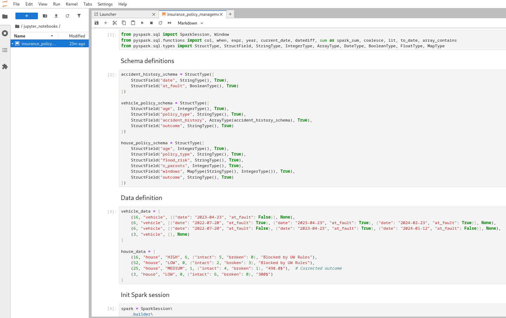
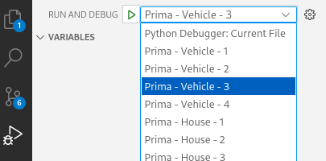

# Insurance Policy Management System

This is just a job interview test case done for a company (lets call it XXX).

## Requirements:
### Background
You are tasked with designing a part of a system for managing insurance policies within an insurance company. The objective is to compute the premium based on the details of a quote request. This system should handle different types of insurance policies such as vehicle insurance and home insurance.

Each type of policy has its unique data attributes and methods for calculating premiums, but before a premium is calculated, each policy must be evaluated against a set of rules to determine if the policy should be approved. These rules are provided by the “creative” Underwriting team and are specifically referred to as "underwriting" rules.


### Underwriting Rules

*As an insurance company we want to prevent the provisioning of a policy to customers classified as high risk profiles so that we can optimize our revenues.*

Here is a starting set of rules to apply:
* Discard cars that still remember when flip phones were cool (older than 15 years).
* Disqualify drivers who treat their car like it's in a demolition derby with more than 2 at-fault accidents in the last 5 years.
* Disqualify households with more than five parrots (high noise and potential chaos risk).
* Disqualify properties with more broken windows than intact ones (indicating severe neglect).


### Bonus-Malus

*As an insurance company we want to dynamically compute premiums to prevent medium risk profiles to threaten our revenues without completely giving up on this piece of the market.*

Considering that vehicles and houses have different base premiums (500$ and 300$ respectively) here is a starting set of malus to apply:
* Add a 5% vintage tax for each year older than 5 years (because classic cars come with a price tag).
* Apply a 20% crash course fee for each accident in the last 3 years (because we believe in paying for our mistakes).
* Boost the premium by 15% for houses in medium-risk (and high-risk also included) flood zones (because we like to keep our heads above water). 
* Implement a 10% retro surcharge if the house is older than 20 years (because old homes come with character and a cost).


## Test Cases

### Vehicle:

| Vehicle Age  | Accident History | Outcome |
|:-------------|------------------|--------|
| 16 years     | [{date: 2023-04-23, at_fault: false}] | Blocked by UW Rules |
| 6 years     | [{date: 2022-07-20, at_fault: true},{date: 2023-04-23, at_fault: true},{date: 2024-02-23, at_fault: true}] | Blocked by UW Rules |
| 6 years     | [{date: 2022-07-20, at_fault: false},{date: 2023-04-23, at_fault: true},{date: 2024-01-12, at_fault: false}] | 630.0$ ** Check whether is a wrong test outcome, should not be an outcome of 825.0$?**|
| 3 years     | [] | 500$ |

### House:

| House Age  | Flood Risk | n Parrots | Windows | Outcome |
|:---|---|---|---|---|
| 16 years     | HIGH               | 6 | intact_windows: 5, broken_windows: 0 | Blocked by UW Rules |
| 52 years     | LOW                | 0 | intact_windows: 2, broken_windows: 3 | Blocked by UW Rules |
| 25 years     | MEDIUM | 1 | intact_windows: 4, broken_windows: 1 | 379.5$ ** Check whether is a wrong test outcome, should not be an outcome of 375.0$?** |
| 3 years     | LOW | 0 | intact_windows: 6, broken_windows: 0 | 300$ |

## Hints
- `app.py` is there to show how a client would interact with the framework. That's optional.
- Use any additional library you think it's useful by using `requirements.txt`

<br/>
<br/>

# Approaches to solve the study case
Just for testing porposes has been created two approaches to solve the study case:

- Using Spark (PySpark)
- Using just Python


## 1. Using Spark (PySpark), e.g.: via Jupyter Notebook
Steps to prepare env for running "insurance_policy_management_system.ipynb"jupyter notebook

<div style="max-height: 250px; overflow-y: auto; border: 1px solid #ccc; padding: 10px;">  



</div>

### Requirements file

requirements_approach_1.txt
```python
jupyterlab==4.3.4
pyspark==3.5.4  
pandas==2.2.3  
```  

### Fist cd <your_project_dir>
```bash
cd <your_project_dir>
```  

### If needed, remove any other previous conda env
```bash
conda remove -n <your_conda_env> --all
```  

### Create conda env
```bash
conda create -n data_enginner_hackerank_pyspark python=3.11
conda activate data_enginner_hackerank_pyspark
```  

### Install dependencies
```bash
pip install requirements.txt
```  

### Launch jupyter lab framework
```bash
jupyter-lab
```  

### Open jupyter notebook
Open "jupyter_notebooks/insurance_policy_management_system.ipynb" and lets fun...

<br/>  

## 2. Python code (no spark)  
### Environment:
Tested using python 3.13.2

### 
A .vscode/launch.json file has been created for debugging applications. It defines how VS Code should launch or attach a debugger to the code. It contains the differente study cases to be tested:
<div style="max-height: 250px; overflow-y: auto; border: 1px solid #ccc; padding: 10px;">

```plaintext
{
    "configurations": [
        {"name":"Python Debugger: Current File","type":"debugpy","request":"launch","program":"${file}","console":"integratedTerminal"},
        {
            "name": "Prima - Vehicle - 1",
            "type": "python",
            "request": "launch",            
            "program": "${workspaceFolder}/src/app.py",
            "console": "integratedTerminal",
            "justMyCode": true,
            "args": [
                    // "house", "{\"age\": \"25 years\", \"flood_risk\": \"HIGH\", \"n_parrots\": 6, \"windows\": {\"intact\": 5, \"broken\": 0}}"                    
                    "vehicle", "{\"age\": \"16 years\", \"accident_history\": [{\"date\": \"2023-04-23\", \"at_fault\": false}]}"                    
                  ]
        },
        {
            "name": "Prima - Vehicle - 2",
            "type": "python",
            "request": "launch",            
            "program": "${workspaceFolder}/src/app.py",
            "console": "integratedTerminal",
            "justMyCode": true,
            "args": [
                    "vehicle","{\"age\": \"6 years\", \"accident_history\":[{\"date\": \"2022-07-20\", \"at_fault\": true},{\"date\": \"2023-04-23\", \"at_fault\": true},{\"date\": \"2024-01-12\", \"at_fault\": true}]}"
                  ]
        },
        {
            "name": "Prima - Vehicle - 3",
            "type": "python",
            "request": "launch",            
            "program": "${workspaceFolder}/src/app.py",
            "console": "integratedTerminal",
            "justMyCode": true,
            "args": [
                    "vehicle","{\"age\": \"6 years\", \"accident_history\":[{\"date\": \"2022-07-20\", \"at_fault\": false},{\"date\": \"2023-04-23\", \"at_fault\": true},{\"date\": \"2024-01-12\", \"at_fault\": false}]}"
                  ]
        },
        {
            "name": "Prima - Vehicle - 4",
            "type": "python",
            "request": "launch",            
            "program": "${workspaceFolder}/src/app.py",
            "console": "integratedTerminal",
            "justMyCode": true,
            "args": [
                    "vehicle", "{\"age\": \"3 years\", \"accident_history\":[]}"
                  ]
        },
        {
            "name": "Prima - House - 1",
            "type": "python",
            "request": "launch",            
            "program": "${workspaceFolder}/src/app.py",
            "console": "integratedTerminal",
            "justMyCode": true,
            "args": [
                    "house", "{\"age\": \"16 years\", \"flood_risk\": \"HIGH\", \"n_parrots\": 6, \"windows\": {\"intact\": 5, \"broken\": 0}}"
                  ]
        },
        {
            "name": "Prima - House - 2",
            "type": "python",
            "request": "launch",            
            "program": "${workspaceFolder}/src/app.py",
            "console": "integratedTerminal",
            "justMyCode": true,
            "args": [
                    "house", "{\"age\": \"52 years\", \"flood_risk\": \"LOW\", \"n_parrots\": 0, \"windows\": {\"intact\": 2, \"broken\": 3}}"
                  ]
        },
        {
            "name": "Prima - House - 3",
            "type": "python",
            "request": "launch",            
            "program": "${workspaceFolder}/src/app.py",
            "console": "integratedTerminal",
            "justMyCode": true,
            "args": [
                    "house", "{\"age\": \"25 years\", \"flood_risk\": \"MEDIUM\", \"n_parrots\": 1, \"windows\": {\"intact\": 4, \"broken\": 1}}"
                  ]
        },
        {
            "name": "Prima - House - 4",
            "type": "python",
            "request": "launch",            
            "program": "${workspaceFolder}/src/app.py",
            "console": "integratedTerminal",
            "justMyCode": true,
            "args": [
                    "house", "{\"age\": \"3 years\", \"flood_risk\": \"LOW\", \"n_parrots\": 0, \"windows\": {\"intact\": 6, \"broken\": 0}}"
                  ]
      }
    ]
}
```
</div>

<br/>
Then you should be able to "Run and debug (Ctrl + Shift + D)" the different cases as you can see next:  
  


